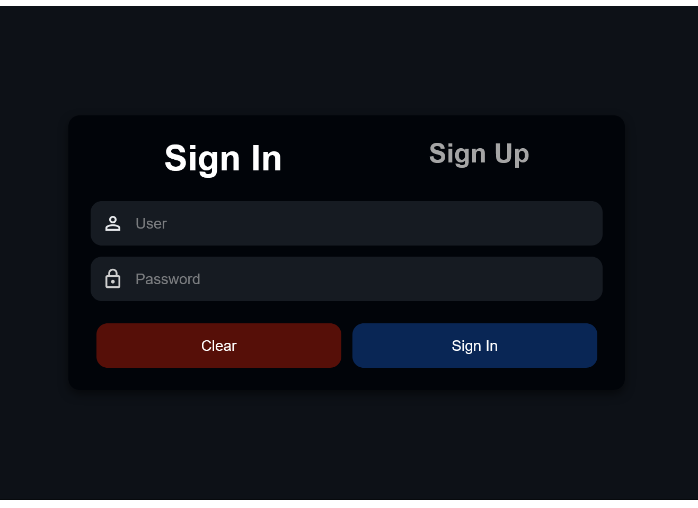
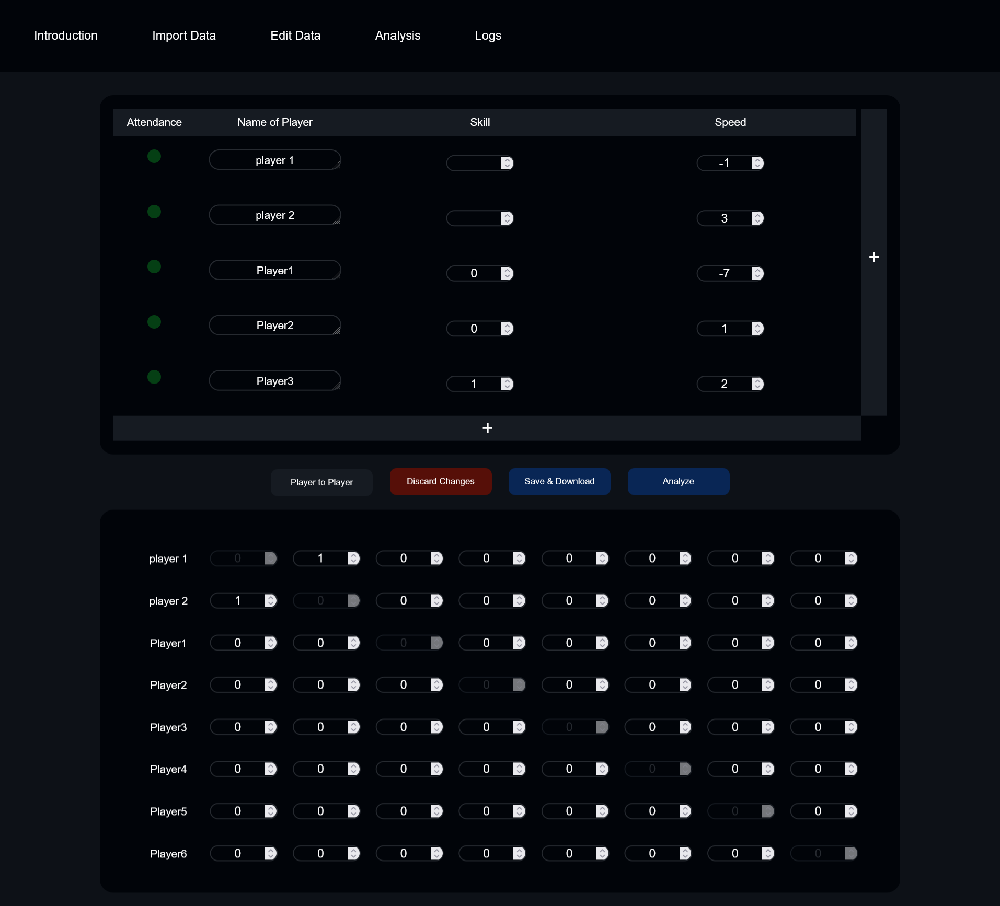

# FairTeamMaker ⚖️


**FairTeamMaker** is a web app designed to create **balanced teams** using player skill scores and their relationships with other players. The app is ideal for organizing teams in school or after-school sports activities, especially for children. It uses a brute force algorithm to find balanced teams, considering both individual player skills and interactions between players.

This project serves as a learning experience and may contain some beginner-level coding practices. Contributions are welcome!

## Features

- **Balanced Team Creation**: Generates fair teams based on player scores and relationships.
- **Brute Force Algorithm**: Systematically evaluates combinations to ensure balanced teams.
- **User Authentication**: Accounts are protected by hashed passwords and JWT tokens.
- **Save & Load**: Projects (including players, scores, relationships, and team configurations) can be saved to a MongoDB database and reloaded later.
- **Custom Inputs**: Users can set skill scores, relationship scores, number of courts (pitches), and allocate players or teams.
- **Team Customization**: Options to set the max number of players sitting out, and balance player distribution across teams and courts.
- **Normalization**: Scores are normalized using a sigmoid function.

## Planned Features

- **Logs**: Keep track of past team matchups, including scores and team compositions.
- **AI-Driven Adjustments**: Automatically adjust player skills and relationships based on past team performance.
- **Category Balancing**: Balance teams based on specific player categories (e.g., attack, defense).
- **Normalization Control**: Option to enable/disable score normalization from the frontend.
- **Auto Save**: Automatically save projects at regular intervals.
- **Additional Balancing Algorithms**: More algorithms, such as greedy and optimization-based approaches, are planned.

## Technologies Used

- **Frontend**: Plain HTML, JavaScript, CSS
- **Backend**: FastAPI, Python (for formatting and brute force), C++ (for brute force algorithm), MongoDB (for storing user data and projects)
- **Authentication**: JWT Tokens for securing routes, hashed passwords

## Installation

1. Install [MongoDB](https://www.mongodb.com/try/download/community).
2. Clone the repository:
   ```bash
   git clone https://github.com/yourusername/FairTeamMaker.git
   ```
3. Navigate to the project directory:
   ```bash
   cd FairTeamMaker
   ```
4. Set up environment variables:
   - Add your MongoDB URL in `app.py`.
   - Set `SECRET_KEY` in a `.env` file.
5. Install the required Python packages:
   ```bash
   pip install -r requirements.txt
   ```
6. Run the application:
   ```bash
   uvicorn app:app --reload
   ```
7. Access the app via [http://localhost:8000](http://localhost:8000):
   - Login: [http://localhost:8000/login](http://localhost:8000/login)

### MongoDB Setup

The database and collections need to be set up manually. You can find the relevant collection setup in the `app.py` file. Current collections:
- `users`
- `projects`
- `logs`

## Usage

1. **Create an Account**: Username and password only (no password recovery yet).
2. **Input Data**: Add player scores and relationship values through the UI:
   - Skill and relationship scores are entered into two separate tables.
   - The user-defined scores are open-ended (categories may have a user-defined range).
3. **Team Customization**: Use the "Analysis" tab to allocate players, set up pitches, and adjust other settings (e.g., max player differences).
4. **Save and Load**: Save your projects to MongoDB or download them locally for later use.

### Interface Overview

- **Introduction**: Basic overview of how to use the app.
- **Import Data**: Import player and relationship data.
- **Edit Data**: Manually edit player scores and relationships in the two tables.
- **Analysis**: Allocate players, set pitches, and adjust balance-related settings.
- **Logs**: (Currently empty, but will log matchups in future updates).

## Scoring and Team Balancing

- **Player Scores**: Represent individual abilities (higher is better). Relationships represent how well players perform together (positive for good pairings, negative for bad).
- **Normalization**: All scores are normalized through a sigmoid function for fairness.
- **Algorithm**: The brute force algorithm starts from a random point and systematically generates team combinations, aiming to minimize the difference in total score between teams.

## Contribution Guidelines

Contributions are welcome! However, since this is a learning project, the base may contain beginner-level practices. Pull requests will be reviewed carefully for security and correctness, which may take time. Please ensure that:

- Your code is secure and follows best practices.
- You include tests or examples where relevant.
- Pull requests are descriptive and linked to a specific issue (if applicable).

## Security

- **JWT Authentication**: Secure routes with JSON Web Tokens (JWT) and hashed passwords.
- **HTTPS**: While HTTPS is not included, users are encouraged to set it up themselves for deployment.

## License

This project is licensed under the MIT License. See the [LICENSE](./LICENSE) file for details.

## Contact

For questions or issues, feel free to reach out via:
- **GitHub Issues**
- **Email**: jakobutze@proton.me

## Screenshots

- **Login Page**


- **Edit Data Tab** (Player and Relationship Tables)



- **Analysis Results** (Team Balance Overview)